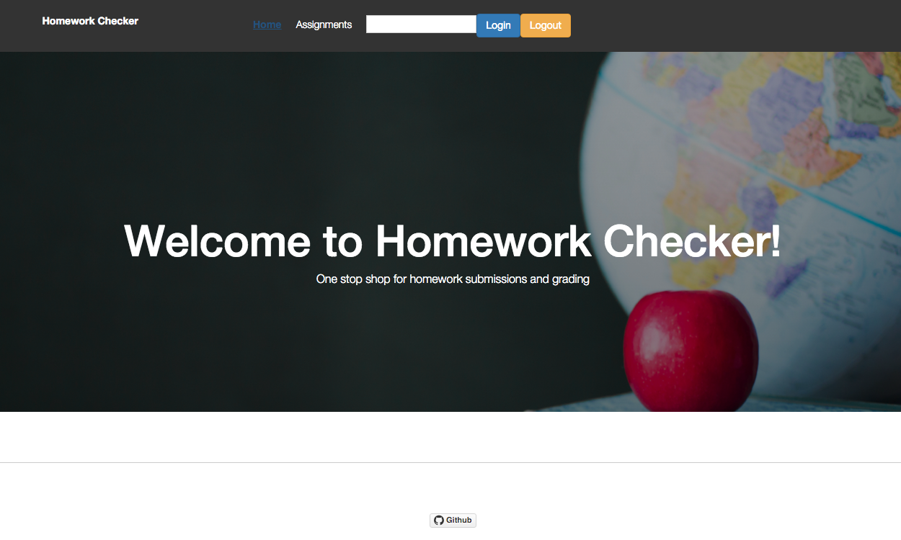

Homework Checker
=========================



## Table of Contents

- [About](#about)
- [Installation](#installation)
- [Development](#development)

## About
- Application that allows students to see homework/assignments assigned to them by their teacher. They will be able to answer the homework questions and submit them before the due date. Teachers will be able to see all assignments they have created, and see all the answers that have been submitted for that question.


## Installation
```
$ git clone https://github.com/rscastro/homeworkChecker.git
$ cd homeworkChecker
$ npm install
```
- You must have PostgresSQL installed on your machine with a database named 'edmodo' created. Once you run npm start, all the necessary tables will be created. 

## Development
```
$ npm start
```
Runs the project in development mode with hot-reloading of `src` folder. 
Open your browser at [http://localhost:3000](http://localhost:3000).

At the moment, there is no form/module to insert users/assignments/connections into the DB. They have to be inserted through a POST request onto the necessary API routes, or inserted directly on the psql CLI.

## Contribution
- [SEE HERE](https://github.com/rscastro/homeworkChecker/blob/master/CONTRIBUTING.md)


## ROADMAP
- Real login/OAuth
- Currently has no way of creating assignments as a teacher, or assigning them. Everything done through backend
- Needs more categories instead of just text-based-answer questions
